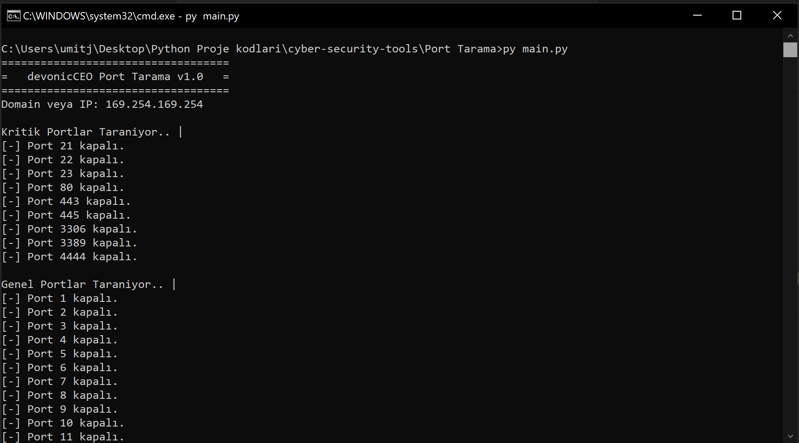

# Cyber Security Tools Projects

## Alfabe

[A](#a) | [B](#b) | [C](#c) | [D](#d) | [E](#e) | [F](#f) | [G](#g) | [H](#h) | [I](#i) | [J](#j) | [K](#k) | [L](#l) | [M](#m) | [N](#n) | [O](#o) | [P](#p) | [Q](#q) | [R](#r) | [S](#s) | [T](#t) | [U](#u) | [V](#v) | [W](#w) | [X](#x) | [Y](#y) | [Z](#z)

## P

### Port Scaning

- [Port Scaning](port-scaning-tool/)

    

- [LICENSE](LICENSE)
